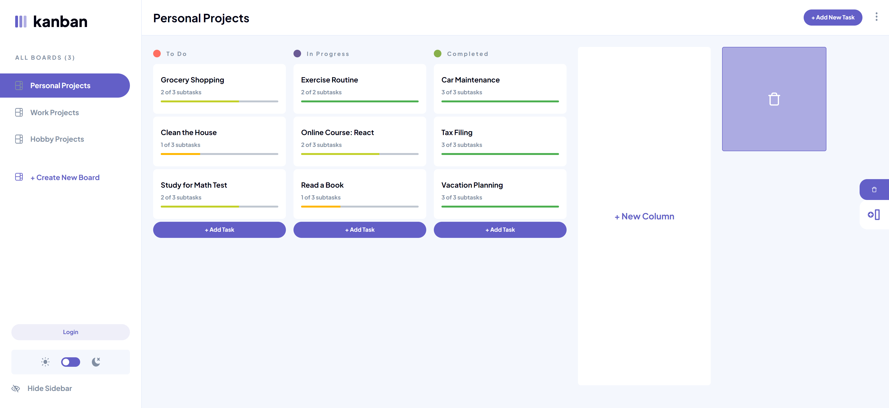

<div align="center">
  <br />
  <a href="https://task-management-app-lovat.vercel.app/" target="_blank">
    
  </a>
  <br />

  <div>
    
    
    
    
  </div>

<h1 align="center">Task Management App</h1>

  <p align="center">A responsive task management application with drag-and-drop functionality and dark/light mode support.</p>
</div>

## 🚀 Features

- **Responsive Design:** Seamlessly works across devices.
- **Drag-and-Drop:** Intuitive task management with smooth animations.
- **Dark/Light Mode:** Switch between themes effortlessly.
- **Real-Time Updates:** Keep your tasks synced across sessions.
- **Backend Integration:** Powered by Prisma for efficient data management.

## 🛠️ Tech Stack

- **Frontend:** Next.js, TypeScript, Tailwind CSS
- **Backend:** Prisma
- **Animations:** Framer Motion

## 📸 Screenshots

### Light Mode Preview

<p align="center">
  
</p>

### Task Details Preview (Dark Mode)

<p align="center">
  
</p>

### Task Details Preview (Light Mode)

<p align="center">
  
</p>

### Add Task Preview (Dark Mode)

<p align="center">
  
</p>

### Add Task Preview (Light Mode)

<p align="center">
  
</p>

## 📦 Installation

1. Clone the repository:
   ```bash
   git clone https://github.com/TofikE124/task-management-app.git
   ```
